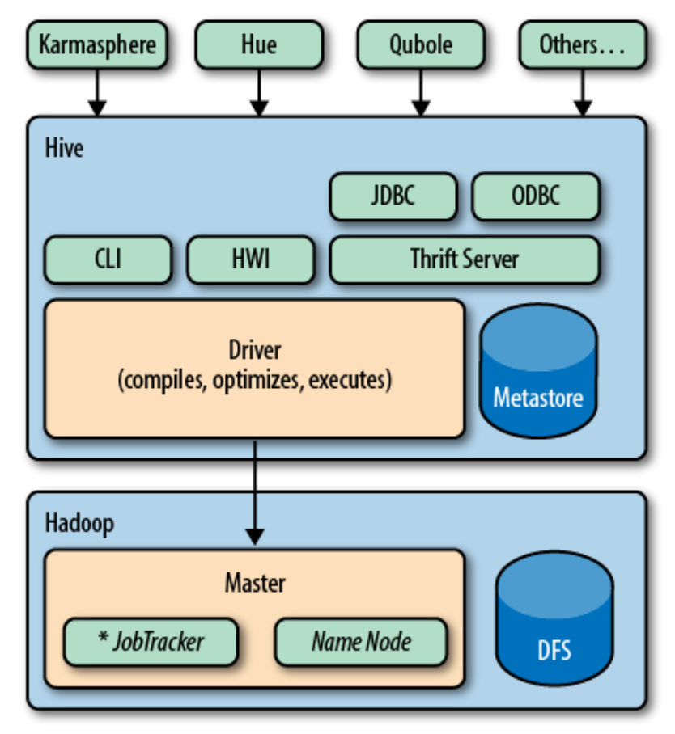

# Hive

## Overview

Hive runs on top of Java and Hadoop.

<p float="left">
    
</p>

## Installation

### Java

1. Update `.bashrc`:
```bash
export JAVA_HOME=/usr/lib/jvm/java-8-openjdk-amd64
export PATH=$PATH:$JAVA_HOME/bin
```

2. Check whether `java -version` can locate the specified Java binary:
```bash
ls -al /usr/bin/java
/usr/bin/java -> /etc/alternatives/java

ls -al /etc/alternatives/java
/etc/alternatives/java -> /usr/lib/jvm/java-8-openjdk-amd64/bin/java

sudo rm /etc/alternatives/java
sudo ln -s /usr/lib/jvm/java-8-openjdk-amd64/bin/java /etc/alternatives/java
```

### Hadoop

1. Download the Hadoop binary:
```bash
wget https://downloads.apache.org/hadoop/common/hadoop-3.3.1/hadoop-3.3.1.tar.gz
tar -xvzf hadoop-3.3.1.tar.gz

sudo mv hadoop-3.3.1 /usr/local/hadoop

sudo mkdir /usr/local/hadoop/logs
sudo chown -R shu:shu /usr/local/hadoop

sudo mkdir -p /home/shu/hdfs/{namenode,datanode}
sudo chown -R shu:shu /home/shu/hdfs
```

2. Update `.bashrc`:
```bash
export HADOOP_HOME=/usr/local/hadoop
export HADOOP_INSTALL=$HADOOP_HOME
export HADOOP_MAPRED_HOME=$HADOOP_HOME
export HADOOP_COMMON_HOME=$HADOOP_HOME
export HADOOP_HDFS_HOME=$HADOOP_HOME
export YARN_HOME=$HADOOP_HOME
export HADOOP_COMMON_LIB_NATIVE_DIR=$HADOOP_HOME/lib/native
export PATH=$PATH:$HADOOP_HOME/sbin:$HADOOP_HOME/bin
export HADOOP_OPTS="-Djava.library.path=$HADOOP_HOME/lib/native"
```

3. Update `/usr/local/hadoop/etc/hadoop/hadoop-env.sh`:
```bash
export JAVA_HOME=/usr/lib/jvm/java-8-openjdk-amd64
export HADOOP_CLASSPATH+=" $HADOOP_HOME/lib/*.jar"
```

4. Download `javax.activation-api-1.2.0.jar` in `/usr/local/hadoop/lib`:
```bash
cd /usr/local/hadoop/lib
sudo wget https://jcenter.bintray.com/javax/activation/javax.activation-api/1.2.0/javax.activation-api-1.2.0.jar
```

5. Verify the Hadoop version:
```bash
 hadoop version
 ```

6. Update `/usr/local/hadoop/etc/hadoop/core-site.xml`:
```bash
<configuration>
   <property>
      <name>fs.default.name</name>
      <value>hdfs://0.0.0.0:9000</value>
      <description>The default file system URI</description>
   </property>
</configuration>
```

7. Update `/usr/local/hadoop/etc/hadoop/hdfs-site.xml`:
```bash
<configuration>
   <property>
      <name>dfs.replication</name>
      <value>1</value>
   </property>

   <property>
      <name>dfs.name.dir</name>
      <value>file:///home/shu/hdfs/namenode</value>
   </property>

   <property>
      <name>dfs.data.dir</name>
      <value>file:///home/shu/hdfs/datanode</value>
   </property>
</configuration>
```

8. Update `/usr/local/hadoop/etc/hadoop/mapred-site.xml`:
```bash
<configuration>
   <property>
      <name>mapreduce.framework.name</name>
      <value>yarn</value>
   </property>
 <property>
    <name>yarn.app.mapreduce.am.env</name>
    <value>HADOOP_MAPRED_HOME=/usr/local/hadoop</value>
  </property>

  <property>
    <name>mapreduce.map.env</name>
    <value>HADOOP_MAPRED_HOME=/usr/local/hadoop</value>
  </property>

  <property>
    <name>mapreduce.reduce.env</name>
    <value>HADOOP_MAPRED_HOME=/usr/local/hadoop</value>
  </property>
</configuration>
```

9. Update `/usr/local/hadoop/etc/hadoop/yarn-site.xml`:
```bash
<configuration>
   <property>
      <name>yarn.nodemanager.aux-services</name>
      <value>mapreduce_shuffle</value>
   </property>
</configuration>
```

10. Format the HDFS namenode:
```bash
hdfs namenode -format
```

11. Start the cluster:
```bash
# start the HDFS namenode and datanode
start-dfs.sh

# start the YARN nodemanager and resourcemanager
start-yarn.sh
```

12. Access the HDFS namenode: [http://localhost:9870/](http://localhost:9870/).
13. Access the YARN nodemanager: [http://localhost:8088/cluster](http://localhost:8088/cluster).

### Hive

1. Download the Hive binary from [this link](https://hive.apache.org/downloads.html).
```bash
mv apache-hive-3.1.2-bin /usr/local/hive
```

2. Update `.bashrc`:
```bash
export HIVE_HOME=/usr/local/hive
export PATH=$PATH:$HIVE_HOME/bin
````

3. Initiate the Derby DB in the local mode:
```bash
schematool -initSchema -dbType derby
```

4. Start Hive:
```bash
hive
```

## Word Count

### Hive

1. Prepare the local file `docs` as below:
```
Mary had a little lamb
its fleece was white as snow
and everywhere that Mary went
the lamb was sure to go
```

2. Execute the following statements in the Hive shell:
```bash
CREATE TABLE docs (line STRING);

LOAD DATA LOCAL INPATH 'docs' OVERWRITE INTO TABLE docs;

CREATE TABLE words AS SELECT word, count(1) AS count FROM (SELECT explode(split(line, ' ')) AS word FROM docs) w GROUP BY word;
```

## References
* https://www.vultr.com/docs/install-and-configure-apache-hadoop-on-ubuntu-20-04/
* https://cwiki.apache.org/confluence/display/hive/avroserde
